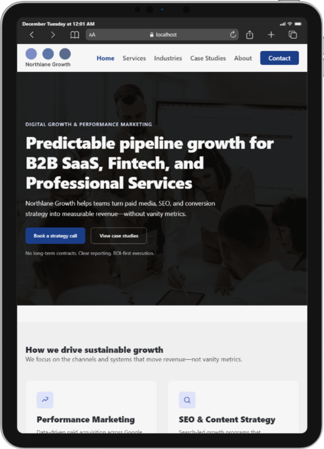
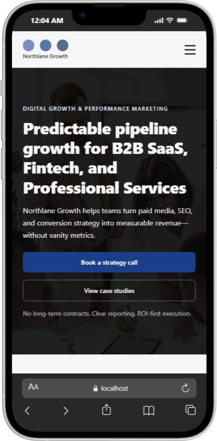

# Northlane Growth

Northlane Growth is a digital growth and performance marketing agency focused on helping B2B SaaS, Fintech, and professional services companies build predictable, scalable revenue.

This repository contains the production-ready website for Northlane Growth, engineered with a strong emphasis on clarity, accessibility, performance, and real-world frontend best practices.

---

## Overview

The Northlane Growth website is designed to reflect how a modern, high-performing agency presents itself online:

- Clear positioning and messaging
- Strong trust and credibility signals
- Conversion-focused structure
- Clean, scalable frontend architecture

The site is built using **HTML, CSS, and JavaScript** without frameworks to ensure full control, maintainability, and a deep understanding of the fundamentals that power modern web experiences.

---

## Business Challenge

Many companies struggle to turn traffic and marketing spend into predictable pipeline growth. At the same time, many agency websites fail to clearly communicate value, trust, and differentiation due to:

- Poor information hierarchy
- Overly complex or bloated frontend implementations
- Lack of accessibility and performance considerations
- Weak SEO and social-sharing optimization
- Interfaces that look polished but lack real UX depth

---

## Approach & Solution

The Northlane Growth website is built with a **system-first, engineering-led approach**, focusing on:

- Clear user journeys from first impression to conversion
- Semantic and accessible HTML structure
- A scalable CSS architecture using design tokens
- Responsive layouts across desktop, tablet, and mobile
- Real-world JavaScript logic for interactivity and validation
- SEO-friendly metadata and Open Graph support
- Careful attention to usability, accessibility, and performance

Every section of the site is intentionally designed to serve a specific purpose within the customer journey.

---

## Key Features

- Semantic HTML5 structure with proper landmarks
- Design tokens for colors, typography, spacing, and layout
- Responsive navigation with keyboard accessibility
- Hero, Services, Credibility, Pricing, CTA, Contact, and Footer sections
- Dynamic pricing toggle with monthly/yearly logic
- Accessible contact form with inline validation and error states
- Sticky navigation for improved usability
- SEO-ready meta tags and social sharing previews
- Fully responsive design across devices

---

## Design System — Color Palette

The visual identity is intentionally professional, restrained, and brand-focused.

### Backgrounds

- Primary background: `#F6F6F6`
- Secondary background: `#EFEFEF`

### Typography

- Headings: `#2C2E33`
- Body text: `#4C4C4C`

### Brand & Actions

- Primary brand / CTA: `#1B3E89`
- CTA hover: `#182F60`

### Accents

- Accent color: `#4A5FB0`
- Accent surface (icons, highlights): `#DEE3F9`

---

## Accessibility & UX

Accessibility is treated as a core requirement, not an afterthought. The website includes:

- Proper labels for all form inputs
- Fieldsets and legends for grouped controls
- Visible keyboard focus states
- Inline validation feedback
- Logical tab order and keyboard navigation
- Decorative and meaningful image handling
- Strong color contrast for readability

The site is designed to be usable and understandable for all users.

---

## Screenshots

Screenshots showcasing the homepage layout, responsiveness, and key sections can be found in the `/public/screenshots` directory.

### Homepage – Desktop

### Homepage – IPad

### Homepage - IPad Mini

### Homepage - Mobile

---

## Technology Stack

- HTML5
- CSS3 (custom properties, Grid, Flexbox)
- Vanilla JavaScript (ES6+)

No frameworks or UI libraries are used. This is intentional to ensure long-term maintainability and full control over the frontend architecture.

---

## Project Status

The homepage is complete and production-ready.

Additional pages (Services, Case Studies, About, Contact) are being developed using the same design system and engineering principles established here.

---

## Final Notes

This project reflects a commitment to building high-quality digital products with strong fundamentals, thoughtful UX, and scalable frontend architecture.

Northlane Growth is designed to grow—both as a business and as a platform.

---

© Northlane Growth
